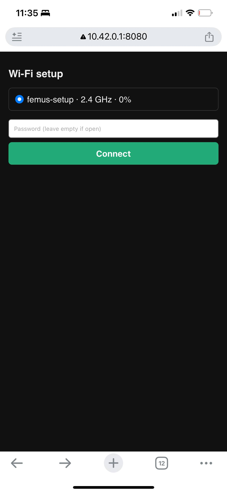

[](https://github.com/sanchescom/php-wifi/actions/workflows/ci.yml)
[](https://packagist.org/packages/sanchescom/php-wifi)
[](https://packagist.org/packages/sanchescom/php-wifi)
[](LICENSE.md)

# PHP WiFi

A cross-platform PHP library for scanning and joining Wi-Fi networks. One
object facade (`WiFi`) drives `nmcli` on Linux, `networksetup` on macOS and
`netsh` on Windows through a shared `Backend` interface, returns immutable
value objects instead of arrays, and ships a CLI (`bin/wifi`) on top of the
same API.

## `wifi list` on a Raspberry Pi

Run over SSH on the maintainer's Pi, unprivileged (`femus`, member of
`netdev`), NetworkManager 1.52.1 — full transcript in
[`docs/verified-on.md`](docs/verified-on.md):

```
$ php bin/wifi device
wlan0
[exit 0]

$ php bin/wifi list
1 network(s) broadcast no SSID (hidden); they are shown as "-".
 SSID             BSSID              Channel  Band  Quality  dBm  Frequency  Connected  Security
-------------------------------------------------------------------------------------------------
 BELL340          0e:ac:8a:99:58:5c  1        2.4   87%      -56  2412       false      WPA2
 VTECH_5764_9764  a6:97:5c:b7:97:64  1        2.4   70%      -65  2412       false      WPA2
 BELL340          0e:ac:8a:99:58:5d  157      5     64%      -68  5785       false      WPA2
 -                0e:ac:8a:99:58:5e  157      5     64%      -68  5785       false      WPA2
[exit 0]
```

The fourth row is a real hidden access point — an empty SSID broadcast
from `0e:ac:8a:99:58:5e`, shown as `-`. (The stderr line above is this
release's wording; `docs/verified-on.md` records the exact run that found
and fixed the earlier, OS-wrong version of it.)

## Requirements

- PHP 8.2, 8.3, 8.4 or 8.5
- `illuminate/collections` 11, 12 or 13 (pulled in automatically; the
  constraint lets the package coexist with Laravel 11–13 applications)
- Linux, macOS (Darwin) or Windows, with the matching system tool: `nmcli`
  (NetworkManager) on Linux, `networksetup` (built in) on macOS, `netsh`
  (built in) on Windows

## Installation

```bash
composer require sanchescom/php-wifi
```

## Quick start

### Scan and read the strongest network

```php
use Sanchescom\WiFi\WiFi;

$wifi = WiFi::create();
$strongest = $wifi->scan()->strongest();

printf("%s: %.0f dBm, %s\n", $strongest->ssid, $strongest->signal->dbm, $strongest->security->value);
```

### Connect

```php
use Sanchescom\WiFi\Value\Credentials;
use Sanchescom\WiFi\WiFi;

$wifi = WiFi::create();
$network = $wifi->scan()->bySsid('My-WiFi-Network');
$wifi->connect($network, Credentials::password('secret123'));
```

The wireless device is detected automatically; pass a third `Device`
argument to override it.

### List known (saved) networks — Linux only

```php
use Sanchescom\WiFi\WiFi;

$wifi = WiFi::create();
foreach ($wifi->knownNetworks() as $known) {
    printf("%s (%s)\n", $known->name, $known->active ? 'active' : 'saved');
}
```

`$known->name` is the NetworkManager connection name; `$known->ssid` is the
real SSID, resolved with one extra `nmcli -g 802-11-wireless.ssid connection
show <name>` call per profile — `knownNetworks()` costs N+1 `nmcli` commands
for N wireless profiles, not one. The two differ for a saved hotspot profile:
a connection named `Hotspot` reports its actual SSID in `$ssid`. A failed
per-profile lookup falls back to the connection name rather than failing the
whole list.

### Start a hotspot — Linux only

```php
use Sanchescom\WiFi\Value\HotspotConfig;
use Sanchescom\WiFi\WiFi;

$wifi = WiFi::create();
$hotspot = $wifi->startHotspot(new HotspotConfig(ssid: 'femus-setup', password: 'change-me-now'));
printf("%s on %s\n", $hotspot->ssid, $hotspot->device);
```

Calling a capability the active backend does not implement (`known` or
`hotspot` on macOS/Windows) throws `UnsupportedOperation`; check first
with `$wifi->supports(SupportsHotspot::class)`.

## Provisioning a headless Raspberry Pi

`examples/provision/` turns a headless Pi into a Wi-Fi setup wizard: it
opens a temporary hotspot and serves a small PHP page that lets a phone
scan and join the real network — no SSH, no keyboard, no monitor. See
[`examples/provision/README.md`](examples/provision/README.md) for the
systemd unit and install steps.



This was taken live on the maintainer's Pi during the 3.0 release, a phone
joined the `femus-setup` hotspot and opened `http://10.42.0.1:8080/`. At the
time the list showed only `femus-setup · 2.4 GHz · 0%`, because while
`nmcli` is running the hotspot on the Pi's one radio, `nmcli device wifi
list` can see the hotspot itself and nothing else — 3.1 fixes this with a
cached scan (below).

A single Wi-Fi radio can either scan or run an access point, never both, so
`hotspot.sh` scans first (`wifi list --unique --json`) and caches the result
to `PROVISION_CACHE` *before* starting the hotspot. `index.php` reads that
cache on every `GET` and labels the list "Scanned before the hotspot
started."; a missing or unreadable cache falls back to a live scan.

Pressing Connect stops the hotspot before joining: while the radio is
running the access point, NetworkManager's own scan list is empty, so it
refuses a join outright no matter what the cached list shows. The phone
loses the page at that point — expected and unavoidable with one radio —
and `index.php` waits a moment for the radio to leave AP mode, then joins
through `WiFi::connect()`, which scans again to resolve the SSID (turning a
typo into `NetworkNotFound` instead of an opaque `nmcli` exit code).

Once a connection succeeds, `index.php` writes an empty marker file at
`PROVISION_DONE` and the run ends with the hotspot down. `hotspot.sh` polls
for that marker once a second (every `RESTART_BACKOFF` seconds while it is
restarting a dropped hotspot), for at most `PROVISION_TIMEOUT` seconds (also
giving up if the web server dies), then stops the built-in PHP server, runs
`wifi hotspot stop` (a no-op by then), and exits — the unit ends itself once
provisioning is done instead of running indefinitely. If the join fails
instead, the hotspot is left down; `hotspot.sh`'s wait loop notices within a
few seconds and brings it back so the phone can rejoin and the person can
retry.

| Variable | Default | Meaning |
| --- | --- | --- |
| `PROVISION_CACHE` | `/run/php-wifi-provision/networks.json` | Where the pre-hotspot scan is cached as JSON. |
| `PROVISION_DONE` | `/run/php-wifi-provision/done` | Marker file created once a connection succeeds. |
| `PROVISION_TIMEOUT` | `900` | Seconds `hotspot.sh` waits for `PROVISION_DONE` before giving up. |
| `RESTART_BACKOFF` | `5` | Seconds to wait between attempts to bring a dropped hotspot back. |
| `MAX_RESTARTS` | `5` | Consecutive failed hotspot restarts before `hotspot.sh` gives up (still exiting `0`). |

See [`examples/provision/README.md`](examples/provision/README.md) for the
full install steps and the `provision.service` unit that provisions
`/run/php-wifi-provision` for these two files.

## Design

**Pure parsers over real fixtures.** Every `src/Parser/**` class is a pure
function: tool output in, a `list<Network>` (or a `Device`, or a list of
`KnownNetwork`) out. No shell calls, no state. Every parser is tested
against real `nmcli --terse`, `system_profiler` and `netsh` output captured
from actual machines, not hand-written approximations of it.

**`Command` owns escaping, and nowhere else does.** `src/Shell/Command.php`
is the only place a program, its arguments and its environment are
rendered into a shell string — `escapeshellarg()` on Linux and macOS,
cmd-safe quoting on Windows. Backends never build a shell string
themselves; they build a `Command` and hand it to a `CommandRunner`.

**`null` over sentinels.** 2.x reported an unreadable signal as `-100 dBm`
/ `0%` and an unrecognised channel as `frequency === 0` — both
indistinguishable from a real (if extreme) reading. 3.0 reports `null`:
`$network->signal`, `$network->channel`, `$network->band` and
`$network->frequency` are all nullable, and nothing else is overloaded to
mean "unknown".

**Capability interfaces, not silent no-ops.** Known-networks and hotspot
support are declared as `SupportsKnownNetworks` and `SupportsHotspot`
interfaces that only `NmcliBackend` implements. Calling `knownNetworks()`
or `startHotspot()` against a `Backend` that does not implement the
relevant interface throws `UnsupportedOperation` immediately, instead of
returning an empty list or silently doing nothing.

## Platform matrix

| Capability | Linux (`nmcli`) | macOS (`networksetup`) | Windows (`netsh`) |
| --- | --- | --- | --- |
| scan | ✅ verified live (NetworkManager 1.52.1) | ✅ verified live — SSIDs come back redacted unless the process running PHP has Location Services; BSSIDs are never reported for other networks | ✅ tests only — no Windows machine |
| connect | ✅ verified live | ✅ tests only — not run against real hardware in 3.0 | ✅ tests only |
| disconnect | ✅ verified live | ✅ tests only — not run against real hardware in 3.0 | ✅ tests only |
| detect (`device()`) | ✅ verified live | ✅ verified live | ✅ tests only |
| known networks | ✅ verified live | ❌ throws `UnsupportedOperation` | ❌ throws `UnsupportedOperation` |
| hotspot | ✅ verified live | ❌ throws `UnsupportedOperation` | ❌ throws `UnsupportedOperation` |

See [`docs/verified-on.md`](docs/verified-on.md) for the raw commands
behind every "verified live" cell above.

On Windows, a 6 GHz network is only reported as `Band::GHz6` when `netsh`
prints a `Band :` field for it (Windows 11 22H2 and later); on older
builds it falls back to a channel-derived guess.

## Linux — Privileges (polkit)

`nmcli device wifi connect` asks NetworkManager to create and activate a
connection. A user logged in at the console is allowed by default; a PHP
process running as `www-data` (PHP-FPM, a queue worker, cron) is not — it
fails with *Not authorized to control networking* or *Insufficient
privileges*. Grant it the three NetworkManager actions this library uses:

```js
// /etc/polkit-1/rules.d/50-php-wifi.rules
polkit.addRule(function (action, subject) {
    if (subject.user === "www-data" &&
        (action.id === "org.freedesktop.NetworkManager.network-control" ||
         action.id === "org.freedesktop.NetworkManager.wifi.scan" ||
         action.id === "org.freedesktop.NetworkManager.settings.modify.system")) {
        return polkit.Result.YES;
    }
});
```

On systems whose polkit still uses `localauthority` (Debian 11 and older):

```ini
# /etc/polkit-1/localauthority/50-local.d/php-wifi.pkla
[php-wifi]
Identity=unix-user:www-data
Action=org.freedesktop.NetworkManager.network-control;org.freedesktop.NetworkManager.wifi.scan;org.freedesktop.NetworkManager.settings.modify.system
ResultAny=yes
ResultInactive=yes
ResultActive=yes
```

> [!NOTE]
> On Debian and Raspberry Pi OS, adding the user to the `netdev` group
> (`adduser www-data netdev`) grants only `settings.modify.system`; the
> connect call still needs `network-control`, so use one of the rules above.

**Live finding (Raspberry Pi, Debian 13, 2026-09-09/10):** `netdev`
membership alone lets an unprivileged process scan
(`org.freedesktop.NetworkManager.wifi.scan`) and add a connection profile
(`settings.modify.system`), but not activate one
(`network-control`). Concretely: `wifi hotspot start` and `wifi connect`
called without `network-control` are refused with `PermissionDenied` — but
the connection profile NetworkManager creates on the way to activation is
not rolled back, so a refused call still leaves a profile behind. Running
the same command once unprivileged (refused) and once with `sudo`
(succeeds) therefore creates two profiles with the same name; `wifi forget
<name>` removes one profile per call, so a duplicate needs two calls.

## Security

Every command a backend runs is built as a `Command` value object
(`src/Shell/Command.php`) and rendered by exactly one code path: no
backend ever concatenates a shell string itself. On Linux and macOS every
argument goes through `escapeshellarg()`; on Windows, `"`, `%`, `!` and
raw `\n`/`\r` — the five characters that can break out of a `cmd.exe`
double-quoted argument — are replaced with a space. Arguments marked as
secrets (passwords) are never shown in an exception message, a test
assertion helper, or `toDisplay()` — they print as `***`. On Windows, the
profile handed to `netsh` is written to a random file under the system
temp directory (`Backend\Windows\ProfileFile`) with the SSID and
passphrase XML-escaped, and the file is deleted as soon as `netsh` has
read it, including on failure. `CommandFailed::$command` keeps the
original `Command` with the unmasked argument list — `getMessage()` is
masked, but do not dump the exception object into logs or error pages.

## Verified on

[`docs/verified-on.md`](docs/verified-on.md) is the release gate for every
tag from 3.0.0 on: the raw output of `device`, `list`, `list --unique`,
`known`, `hotspot start`/`status`/`stop`, `forget`, and one real `connect`
to the maintainer's own network, run on a Raspberry Pi.

## CLI reference

Installed via Composer, the binary is `vendor/bin/wifi`; from a checkout
of this repository it is `php bin/wifi`.

| Command | Options | Description |
| --- | --- | --- |
| `list` | `--unique`, `--connected`, `--json` | Show surrounding Wi-Fi networks |
| `connect` | `--ssid=`, `--bssid=`, `--password=`, `--password-file=`, `--device=` | Connect to a network — one of `--ssid`/`--bssid` is required |
| `disconnect` | `--device=` | Disconnect from the current network |
| `device` | — | Show the detected Wi-Fi device |
| `known` | — | List known (saved) networks |
| `forget <ssid-or-name>` | — | Forget a known network; prints `Forgot <name>.` |
| `hotspot start` | `--ssid=`, `--password=`, `--password-file=`, `--band=`, `--device=` | Start a hotspot (`--band` is `2.4` or `5`) |
| `hotspot stop` | — | Stop the hotspot |
| `hotspot status` | — | Print `active` or `inactive` |

`--device` is optional everywhere it appears; the wireless device is
detected automatically when omitted.

An SSID or connection name that starts with `-` (e.g. `-my-network`) looks
like an option to the CLI's own parser and must be passed after a literal
`--`: `wifi forget -- -my-network`.

**Exit codes:** `0` success · `1` general error (bad usage, a command the
underlying tool rejected) · `2` `UnsupportedOperation` — the active
backend does not implement the capability (e.g. `known`/`hotspot` on
macOS or Windows) · `3` `PermissionDenied`.

**`--password-file`** reads the password from a file instead of a plain
argv value, keeping the passphrase off the `wifi` command line itself.
On Linux it is still passed to `nmcli` as an argument one process later,
so a local user watching `ps` during the call can still see it; on
Windows it never reaches a command line at all, since it goes through the
temp connection-profile file instead. `--password-file=-` reads it from
stdin instead:

```bash
printf '%s' "$PASSWORD" | wifi connect --ssid=home --password-file=-
```

Exactly one trailing newline is stripped and nothing else, so a passphrase
may legitimately end in a space. `--password` and `--password-file` are
mutually exclusive; an empty file, an empty value, a directory path, or a
tty on stdin are each rejected with a clear message and exit `1`.

**`--json`** prints one JSON object per network instead of the table;
`--unique`/`--connected` still apply first, and the hidden-SSID hint stays
on STDERR so stdout is valid JSON. Real output, trimmed to two networks,
from `WIFI_FAKE_RUNNER=tests/Fixtures/cli/linux WIFI_FAKE_OS=Linux php
bin/wifi list --unique --json`:

```json
[
    {
        "ssid": "BELL340",
        "hidden": false,
        "bssid": "02:00:00:00:00:01",
        "channel": 1,
        "band": "2.4",
        "frequency": 2412,
        "quality": 100,
        "dbm": -50,
        "security": "WPA2",
        "securityFlags": "(none) pair_ccmp group_ccmp psk",
        "connected": false
    },
    {
        "ssid": "",
        "hidden": true,
        "bssid": "02:00:00:00:00:05",
        "channel": 157,
        "band": "5",
        "frequency": 5785,
        "quality": 67,
        "dbm": -67,
        "security": "WPA2",
        "securityFlags": "(none) pair_ccmp group_ccmp psk",
        "connected": false
    }
]
```

`bssid`, `channel`, `band`, `frequency`, `quality` and `dbm` are `null` when
the platform does not report them.

### Testing the CLI without hardware

`bin/wifi` reads two environment variables as a test hook: `WIFI_FAKE_OS`
(one of `Linux`, `Darwin`, `Windows`) selects the backend, and
`WIFI_FAKE_RUNNER` points at a directory containing a `map.json` fixture
map consumed by `FakeCommandRunner` (see `tests/Cli/CliTest.php` and
`tests/Fixtures/cli/**` for real examples). This hook requires a dev
install — `Sanchescom\WiFi\Test\Support\FakeCommandRunner` is not
autoloaded in a `composer require --no-dev` install.

## API reference

### `WiFi` facade (`Sanchescom\WiFi\WiFi`)

| Method | Returns | Description |
| --- | --- | --- |
| `WiFi::create(?CommandRunner $runner = null)` | `self` (static) | Auto-detects the OS and builds the matching backend |
| `new WiFi(Backend $backend)` | `self` | Construct directly over a given backend (tests, custom runners) |
| `scan()` | `NetworkCollection` | Scan for surrounding networks |
| `connect(Network\|string $network, Credentials $credentials, ?Device $device = null)` | `void` | Connect; a hidden/redacted `Network` throws `InvalidArgument` — pass the SSID as a string instead |
| `connectTo(string $ssid, Credentials $credentials, ?Device $device = null)` | `void` | Join `$ssid` without scanning first — for callers who already know the SSID and want to skip the scan (custom backends, scripted flows); a wrong SSID then surfaces as the backend's own `CommandFailed` rather than `NetworkNotFound` |
| `disconnect(?Device $device = null)` | `void` | Disconnect |
| `device()` | `Device` | The detected wireless device |
| `knownNetworks()` | `list<KnownNetwork>` | Saved connections (Linux only; `UnsupportedOperation` elsewhere) |
| `forget(KnownNetwork\|string $ssid)` | `void` | Remove a known network (Linux only) |
| `startHotspot(HotspotConfig $config)` | `Hotspot` | Start a hotspot (Linux only) |
| `stopHotspot()` | `void` | Stop the hotspot (Linux only) |
| `isHotspotActive()` | `bool` | Whether a hotspot is currently active (Linux only) |
| `supports(string $capabilityInterface)` | `bool` | Whether the active backend implements `SupportsKnownNetworks::class` / `SupportsHotspot::class` |
| `backend()` | `Backend` | The underlying backend instance |

### `NetworkCollection` (extends `Illuminate\Support\Collection<int, Network>`)

| Method | Returns | Description |
| --- | --- | --- |
| `bySsid(string $ssid)` | `Network` | First match, or `NetworkNotFound` |
| `byBssid(Bssid\|string $bssid)` | `Network` | First match, or `NetworkNotFound` |
| `connected()` | `static` | Only connected networks |
| `band(Band $band)` | `static` | Only networks on the given band |
| `security(Security $security)` | `static` | Only networks with the given security |
| `strongerThan(Signal\|float $threshold)` | `static` | Networks at or above a dBm threshold |
| `sortBySignal()` | `static` | Strongest first; networks with no reading last |
| `strongest()` | `Network` | The strongest network with a signal reading, or `NetworkNotFound` |
| `uniqueBySsid()` | `static` | One row per SSID (strongest radio); hidden names are never merged |
| `hasHiddenSsids()` | `bool` | Whether any network's SSID is hidden |

Every other `Illuminate\Support\Collection` method (`all()`, `first()`,
`filter()`, `map()`, …) is inherited and works normally.

> [!NOTE]
> `strongerThan()` compares `Signal->dbm`. On Linux and Windows this value
> is derived from a 0–100 quality percentage (`Signal::fromQuality()`) and
> therefore never exceeds −50 dBm, so a threshold above −50 matches
> nothing on those platforms; macOS reports a real RSSI value instead.

### `Network` (readonly)

| Property | Type | Notes |
| --- | --- | --- |
| `$ssid` | `string` | Empty when the network is hidden |
| `$ssidHidden` | `bool` | True for a hidden SSID or a redacted one (macOS without Location Services) |
| `$bssid` | `?Bssid` | Never available on macOS |
| `$channel` | `?int` | `null` when unknown |
| `$band` | `?Band` | `Band::GHz2_4` / `GHz5` / `GHz6`, or `null` |
| `$frequency` | `?int` | MHz, or `null` |
| `$signal` | `?Signal` | `->dbm` and `->quality`, or `null` when the tool reported none |
| `$security` | `Security` | Enum: `WPA3`/`WPA2`/`WPA`/`WEP`/`Open`/`Unknown` |
| `$securityFlags` | `string` | Raw flags string as the tool printed it |
| `$connected` | `bool` | |

## Contributing

Please read [CONTRIBUTING.md](CONTRIBUTING.md) for details on our code of conduct, and the process for submitting pull requests to us.

## Versioning

We use [SemVer](http://semver.org/) for versioning. For the versions available, see the [tags on this repository](https://github.com/sanchescom/php-wifi/tags).

## Authors

* **Efimov Aleksandr** - *Initial work* - [Sanchescom](https://github.com/sanchescom)

See also the list of [contributors](https://github.com/sanchescom/php-wifi/contributors) who participated in this project.

## License

This project is licensed under the MIT License — see the [LICENSE.md](LICENSE.md) file for details.

Versions up to and including 2.0.0 were published under GPL-3.0. 2.0.1 relicenses the package to MIT; the change is made by the sole author and copyright holder.
